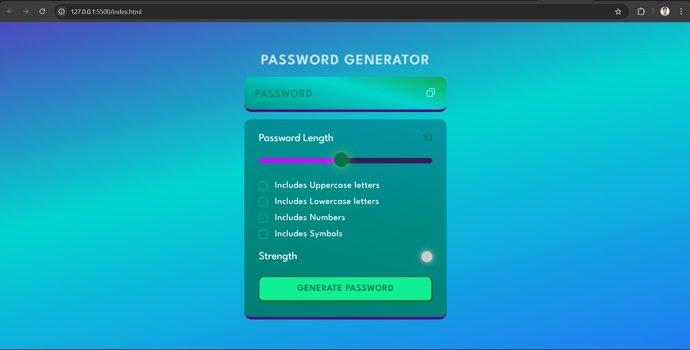

# 🔐 Password Generator


A **simple and secure password generator** built using **HTML, CSS, and JavaScript**.  
Easily generate strong and random passwords with customizable options.

---

## 🚀 Features
- Generate strong passwords with one click.
- Customize:
  - Length of password.
  - Inclusion of uppercase, lowercase, numbers, and special characters.
- Copy to clipboard functionality.
- Responsive UI with clean design.

---

## 📸 Preview




---

## 🛠️ Tech Stack
<p align="left">
  
  
  
</p>


---

## 🏃 Getting Started

### 1. Clone the Repository
```bash
git clone https://github.com/manishinit26/PasswordGenerator.git


2. Navigate to the Project Folder
cd PasswordGenerator

3. Open the Project
Option 1: Open Directly in Browser

Locate the index.html file in your project folder.

Double-click to open it in your default browser.

Option 2: Open in Visual Studio Code

If you have VS Code installed:

code .


Then right-click index.html and select "Open with Live Server" (requires Live Server extension).

🌐 Live Demo

View on GitHub Pages

(Enable GitHub Pages in your repository settings to activate this link.)

🤝 Contributing

Contributions are welcome!
Check the issues page
 for ideas.

📜 License

This project is licensed under the MIT License


⭐ Show Your Support

If you like this project, please give it a star!


---

### Key Features of This README
- Badges for repo stats (size, stars, forks, license)
- Screenshot section with your `image.png`
- Clear setup instructions (Clone → Navigate → Open)
- Icons for HTML, CSS, JS
- Live demo link section

---

Would you like me to **add a "Password Strength GIF Demo"** (animated preview) OR **a Dark Mode Preview** as well for extra polish? Or both?
